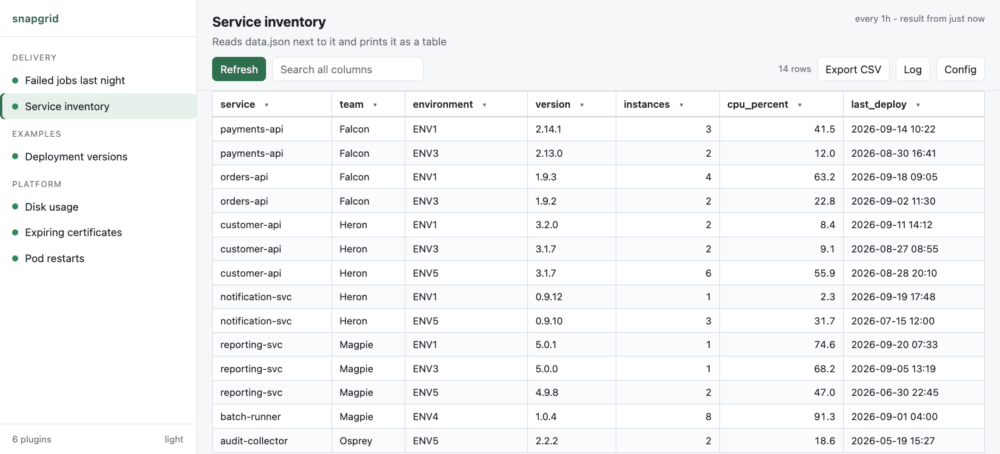
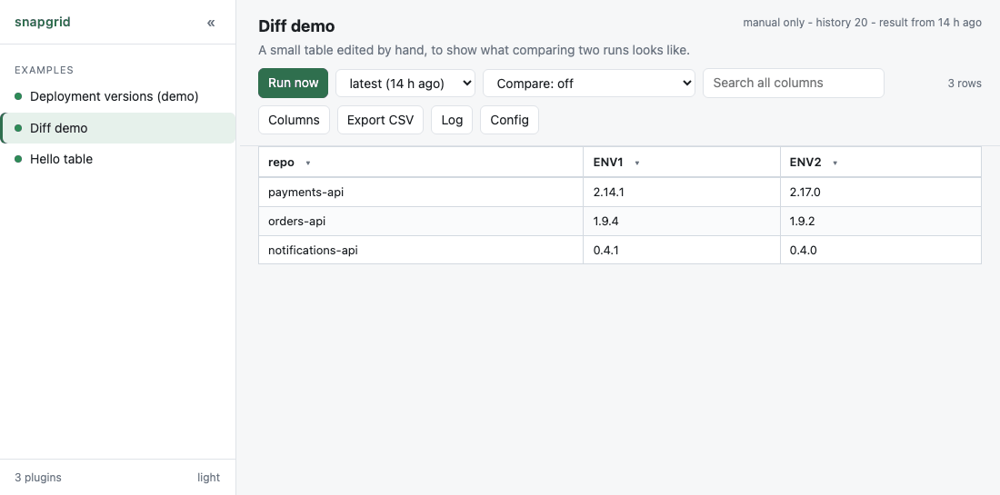
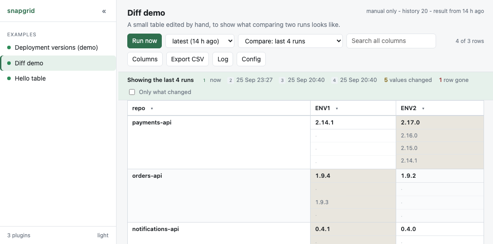
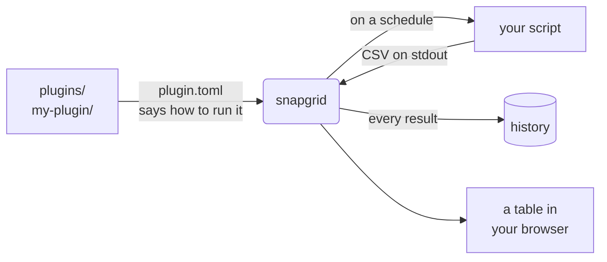

<h1 align="center">snapgrid</h1>

<p align="center">
  <b>Put a script in a folder. Get a table in your browser.</b><br>
  Sortable, filterable, refreshed on a schedule, with history.<br>
  <b>Python standard library only</b> - no pip, no npm, no database server, no container, no internet.
</p>

<p align="center">
  <picture>
    <source media="(prefers-color-scheme: dark)" srcset="docs/demo-dark.gif">
    
  </picture>
</p>

<p align="center"><sub>Sort, filter by value, search, switch plugins. No page reloads, no build step, no dependencies.</sub></p>

<p align="center">
  <a href="https://github.com/NovaForge2/snapgrid/actions/workflows/tests.yml"></a>
  
  
  
  
</p>

---

## Why

Some data has no dashboard and never will. Versions deployed across your
environments, certificates about to expire, which jobs failed last night. The
answer usually exists as a script somebody runs by hand and pastes into chat.

snapgrid turns that script into a page. **Any script, in any language, that can
print CSV.**

```toml
# plugins/my-plugin/plugin.toml
[plugin]
name = "Expiring certificates"

[run]
command = ["bash", "check.sh"]
every   = "1h"
```

```bash
# plugins/my-plugin/check.sh
echo "host,expires,days_left"
echo "api.example,2026-11-02,39"
```

That is a complete plugin. Drop the folder into `plugins/` and within ten
seconds it is a table in the left panel, refreshing itself every hour.

Tools that do something like this generally want a runtime, a container, a
database or a package manager before they will start. snapgrid wants a `git
clone` and a Python that already exists. That is the whole difference, and on a
machine where you are not allowed to install anything, it is the only one that
matters.

### Coming next

Comparing snapshots: what changed between this run and the last one - which
version moved, which certificate got closer to expiring, which job started
failing. Every result is already stored; showing the difference is next.

## Try it now

```bash
git clone https://github.com/NovaForge2/snapgrid.git && cd snapgrid
```

```bash
./server.py --dir examples
```

Open the address it prints. Two example plugins are already there - **Service inventory** reads a
JSON file, the other invents a table whose values drift over time, so you can
watch the history fill up.

When you want to write your own, restart without `--dir`, which uses `plugins/`:

```bash
./server.py stop && ./server.py
```

## What you get

| | |
|---|---|
| **A real grid** | click to sort, per-column filters with value counts, search everything, export CSV |
| **Runs by itself** | every plugin on a schedule, in the background, results cached so the page is instant |
| **History** | every result kept, with a dropdown to look back. Identical runs do not use a slot, so twenty snapshots means the last twenty times something actually changed |
| **What changed** | compare the last 2 to 5 runs in the table itself - values that moved, rows that appeared, rows that went - and click any value for its own history |
| **Secrets handled** | `.env` per plugin, values can be encrypted, and they are masked everywhere they would otherwise be shown or stored |
| **Nothing to learn** | print CSV to standard output, exit 0. That is the whole interface |

## Seeing what changed

A table tells you how things are. The question people actually ask is **what
moved, and when** - and that is what the stored history is for.

<p align="center">
  <picture>
    <source media="(prefers-color-scheme: dark)" srcset="docs/diff-dark.gif">
    
  </picture>
</p>

Pick how far back to look - the run before, or up to five runs - and every cell
fills in with what it held each time, newest on top:

<p align="center">
  <picture>
    <source media="(prefers-color-scheme: dark)" srcset="docs/diff-dark.png">
    
  </picture>
</p>

- **A dot means "the same as the line above."** Only values that actually moved
  are written out, so the eye lands on them rather than on forty repetitions of
  the same version.
- **Nothing is struck through.** An older value was not deleted; it is just
  older, so it is smaller and quieter.
- **Rows that appeared** are marked `NEW`, **rows that went** are marked `GONE`
  and are shown even though they are not in the current result - a repository
  disappearing from an environment is exactly the thing worth noticing.
- **Which run is which** is written once, in the strip above the table. There is
  no room for a date inside a cell, and every cell shares the same runs.
- **Only what changed** narrows a forty row table to the three rows that moved.
- **Click any value** for the full history of that one cell, further back than
  the comparison goes.

Rows are lined up by the column that names them - the first column, or
whichever one `[table] key` names. If the columns are not the same in every run,
comparing is refused with a reason rather than guessing which column is which.

The view is in the address, so a link carries it:

```
http://127.0.0.1:8765/?plugin=image-versions&compare=3&changed=1
```

## How it works



## Requirements

Python 3.11 or newer. That is the whole list. Check with:

```bash
python3 -c "import sqlite3, tomllib; print('ready')"
```

`./server.py` finds a working interpreter itself - it tries `python3`, `python`
and `py`, and uses the first that actually runs, not merely the first that
exists. If your shell will not run the file directly, `python -m snapgrid` and
`python server.py` do the same thing and take the same commands.

## Starting and stopping

```bash
./server.py
```

Where a detached process can be tracked and killed reliably, it runs in the
background and prints the address. Where it cannot, it runs in the terminal you
started it from and Ctrl+C stops it. Either way you can be explicit:
`./server.py start` always runs in the background, `./server.py serve` always
runs in the foreground.


```
snapgrid is running in the background at http://127.0.0.1:8765
  stop   ./server.py stop
  log    plugins/.snapgrid/server.log
```

With no plugins, the page says so and shows the command for running the
examples folder. That message goes away as soon as there is one plugin.

```bash
./server.py status
```

```bash
./server.py stop
```

The address does not move, so it is worth bookmarking. It is 8765 unless you
say otherwise, and `status` and `stop` find the running server without you
having to remember anything. Add `--open` to open your browser as well.

If that port is already taken, snapgrid says so and stops, rather than quietly
moving to another one and changing the address under your bookmark. It also
tells you whether the thing already there is another snapgrid or something
else. To use a different port permanently, set it in `snapgrid.toml`.

To watch it in a terminal instead, run it in the foreground and stop it with
Ctrl+C:

```bash
./server.py serve
```

If `./server.py` does not work on your system, `python3 -m snapgrid` takes the
same commands.

### What it writes to disk

Three files, in a hidden `.snapgrid` folder inside your plugins folder. It is
made on first start and nothing else on the machine is touched.

```
plugins/.snapgrid/
    snapgrid.db      every run and every result
    server.log       the server's own log
    server.json      the pid and port of the running server
```

`snapgrid.db` is **SQLite**, which is part of Python - a file, not a service to
install or run. There is one of it for the whole server, holding every plugin's
runs and results; nothing is written into a plugin's own folder. You may also see `snapgrid.db-wal` and `snapgrid.db-shm` beside
it while the server is up; those are SQLite's own working files.

Deleting the folder loses your history and nothing else: it is rebuilt on the
next start.

One plugins folder is one workspace with its own database, so a second folder
is completely independent. `--data` puts these files somewhere else, and if
your plugins folder is a repository of your own, add `.snapgrid/` to its
`.gitignore`.

You can read the database with anything that speaks SQLite, which is a quick
way to see what happened without the page:

```bash
sqlite3 plugins/.snapgrid/snapgrid.db \
  "select plugin_id, status, error from runs order by id desc limit 10"
```

The tables are described in
[docs/configuration.md](docs/configuration.md#what-is-on-disk).

## Your first plugin

A plugin is a folder. Copy the example and edit it:

```bash
cp -r examples/hello-table plugins/my-plugin
```

```
plugins/my-plugin/
    plugin.toml     what it is called and how to run it
    main.py         the script itself, in any language
    data.json       anything else it needs, in this case its data
    .env            optional, secrets for this plugin only
```

The whole folder belongs to the plugin, so a script can read a file next to it
by name.

The folder appears in the web page within about ten seconds. No restart.

If you are having an AI assistant write the plugin, point it at
[AGENTS.md](AGENTS.md) - the same rules written as a specification, with the
output contract, every `plugin.toml` key, worked examples in Python and shell, a
checklist, and what each error message means.

Plugins usually live in a folder of their own rather than in this checkout, and
an assistant working there will not see this repository. Copy the file across so
it does:

```bash
cp AGENTS.md ~/my-plugins/
```

### The contract

Whatever language you write in, three rules:

1. **Standard output is the table.** CSV, starting with a header line. Or a
   file, or a spreadsheet - see
   [where the table comes from](docs/where-the-table-comes-from.md).
2. **Standard error is the log.** Progress, warnings, anything for a human.
3. **The exit code decides.** `0` means success, anything else is a failure.

That is the entire interface. It also means you can test a plugin without
snapgrid at all:

```bash
cd plugins/my-plugin && python3 main.py
```

What you see is exactly what snapgrid sees. If that output looks right, the
plugin is right.

## plugin.toml

<details>
<summary><b>Every setting</b> - name, group, command, timeout, schedule, columns, output file, history</summary>

Also written out key by key, with every accepted value and every refusal message, in
[docs/plugin-toml.md](docs/plugin-toml.md).

Only `[plugin] name` and `[run] command` are required.

```toml
[plugin]
name        = "OpenShift Image Versions"   # required: shown in the left panel
description = "Image version per repo per environment"
group       = "OpenShift"                  # heading in the left panel
enabled     = true                         # false hides it completely

[run]
command = ["python", "main.py"]            # required: no shell, just arguments
timeout = "5m"                             # default 5m; seconds also work
every   = "15m"                            # default 15m; "off" for manual only

[table]
columns = ["environment", "image", "version"]

[output]
file = "report.csv"                        # optional: read the table from a file

[history]
keep = 20
```

### `[plugin] group`

Plugins that give the same `group` are listed together under one heading in the
left panel. That is all there is to it - there is nothing to declare anywhere
else, and no list of groups to keep up to date. A group exists because a plugin
names it, and stops existing when the last plugin that named it is gone.

```toml
# plugins/cert-expiry/plugin.toml
[plugin]
name  = "Expiring certificates"
group = "Platform"
```

```toml
# plugins/pod-restarts/plugin.toml
[plugin]
name  = "Pod restarts"
group = "Platform"        # the same string, so the same heading
```

Groups are ordered alphabetically, and plugins within a group likewise - not by
folder name, and not by the order you created them. Plugins with no `group` sit
together at the top under **Plugins**.

If you want a particular order, put it in the names: a group called
`1 Platform` sorts before `2 Delivery`. That is a workaround rather than a
feature, and if it turns out to matter, explicit ordering is worth adding
properly.

### `[run] command`

A list of arguments, never a shell command line. There is no shell involved, so
quoting, `&&`, pipes and redirects do not work - put those in a shell script and
run that instead.

```toml
command = ["python", "main.py"]            # Python
command = ["bash", "report.sh"]            # shell script
command = ["java", "-jar", "report.jar"]   # Java
command = ["python", "main.py", "--all"]   # fixed arguments are fine
```

A bare `python` or `python3` means the same interpreter that is running
snapgrid, whichever of the two names exists. Use a full path if you deliberately
want a different one.

### `[table] key`

Which column names each row. It is what lets two runs be lined up when
comparing them, so that a version changing reads as *this row changed* rather
than *one row left and another arrived*.

```toml
[table]
key = "repo"        # the first column unless you say otherwise
```

Rarely needed: the first column is the key by default. Set it when the naming
column is not first. The key column is never compared - a different value there
is a different row.

### `[table] columns`

Optional. Leave it out and the header line of the output decides the columns and
their order.

When it is present, the header line must match it **exactly**, in names and
order. A mismatch fails the run and shows both lists. That is the point: it
catches a script that quietly changed its output, instead of silently putting
your data under the wrong headings.

### `[output] file`

If your script already writes a file and prints progress while it works, point
snapgrid at the file instead of making the script keep stdout clean:

```toml
[output]
file = "report.csv"
```

Everything the script prints then becomes the run log, to either stream, and
the file is the table. Nothing else about the plugin changes.

**A spreadsheet works too.** Name an `.xlsx` and it is read as one - text,
numbers, dates, booleans and formula results, from the first sheet or the one
you name:

```toml
[output]
file  = "report.xlsx"
sheet = "Summary"        # optional, the first sheet otherwise
```

No library is needed for this: an `.xlsx` is a zip of XML, and Python can read
both. The old binary `.xls` format is not supported - save it as `.xlsx` or
`.csv`.

**If the file is recent, do not run the script at all:**

```toml
[output]
file      = "report.csv"
fresh_for = "30m"
```

A scheduled run first looks at the file. If it was written less than half an
hour ago it is used as it stands and the plugin is not started - useful when
the work is expensive, or when something else already refreshes the file.
Pressing **Run now** always runs the plugin: asking for it explicitly means
wanting new data, not the file you are already looking at.

If the file is missing, older than that, or unreadable, the plugin runs as
normal.

**A plugin need not run anything at all.** With no `[run] command`, a folder
containing a manifest and a file is a plugin: snapgrid re-reads the file on
each run, so editing it updates the table, and an unchanged file does not
count as a change.

```toml
[plugin]
name = "Contact list"

[run]
every = "1h"

[output]
file = "contacts.xlsx"
```

The file has to live inside the plugin folder, and it has to be written by the
run in progress. A file left from an earlier run is refused with a message
saying when it was written - showing yesterday's numbers as though they were
current is worse than showing an error.

### `[run] every`

A number and a unit: `s` seconds, `m` minutes, `h` hours, `d` days, `w` weeks.
Or `off` for manual only.

```toml
every = "30s"     every = "2h"      every = "10d"
every = "15m"     every = "1d"      every = "off"
```

The interval is measured from the moment the previous run **finished**, so a
plugin can never overlap with itself and a slow plugin does not fall behind.
The last finish time is stored rather than kept in memory, so a plugin that
runs every ten days survives restarts instead of starting its ten days again
each time the server does. If the server was off when a run came due, it
happens once at the next start, not once for every interval that passed.

Two things this deliberately is not. It is not a clock: `1d` means "a day after
the last one finished", not "at nine every morning". And a run that takes an
hour pushes the next one an hour later. For a daily report that has to land
before people arrive, that drift matters - say so, and clock-based timing
becomes worth adding.

Plugins that keep failing are slowed down rather than retried at full speed:
after three failures in a row the interval doubles each time, up to an hour, and
the first success puts it back to normal. Without that, one expired password
fills your history with hundreds of identical failures overnight.

The page says when a plugin is being held back and when it will next be tried,
rather than simply going quiet. **Run now** runs it immediately anyway, and
**editing `plugin.toml` clears the wait** - changing a plugin is how you fix a
failing one, and having to wait out an hour to find out whether it worked is no
use to anybody.

Only a few plugins run at once (three by default, `--max-concurrent`), because
plugins usually talk to the same system with the same credentials. The rest wait
in a queue. Pressing Run now puts that run at the front of the queue, because
you are sitting there watching it.

### `[run] timeout`

How long one run may take. Exceed it and the process, **and anything it
started**, is killed; the run is marked failed and the previous good table
stays on screen.

```toml
[run]
timeout = "10m"        # or 600 - a plain number is seconds
```

Note that it has to be under `[run]`. In TOML a key belongs to the section
header above it, so a `timeout` appended to the end of the file belongs to
whatever section came last - snapgrid refuses that and says where it should go,
rather than ignoring it.

The default is **five minutes**, deliberately short: most plugins finish in a
second or two, and a plugin that hangs occupies one of the few worker slots
until something stops it.

This is per-plugin, in that plugin's own `plugin.toml` - not in
`snapgrid.toml`, which configures the server. A disk check wants thirty seconds
and a sweep across a dozen environments might want half an hour, and one number
for all of them would have to be the largest.

A stopped run tells you where it got to:

```
the plugin was stopped after 600 seconds ([run] timeout).
Last thing it printed: connecting to ENV4
```

Whatever it had printed to standard output before it was stopped is kept in the
log as well. The half-finished table is never shown as a result.

A plugin that times out every time is usually stuck rather than slow: a network
call with no timeout of its own is the usual cause. Time it by hand before
raising the number - `time python3 main.py` takes exactly as long there as it
does here. There is no way to turn the timeout off, because a plugin that never
finishes holds a worker for ever.

### `[history] keep`

Without this section, only the latest result is kept.

With `keep = 20`, the last twenty **different** results are kept. A run that
produces exactly the same table as the one before does not use a slot - it just
updates when that result was last seen. So on a 15 minute schedule, twenty
snapshots means the last twenty times something actually changed, not the last
five hours.

The most recent successful result is always kept, even if every run since then
has failed, so a broken credential never costs you the last good table.

</details>

## Secrets

A `.env` file in a plugin folder is loaded for that plugin only. Values can be
stored encrypted so a password is not readable over your shoulder:

```bash
./server.py encrypt
```

The plugin reads an ordinary environment variable and knows nothing about it,
and decrypted values are masked wherever they would otherwise be shown or
stored. See [docs/secrets.md](docs/secrets.md).

## Tests

```bash
./run-tests.py
```

Nothing to install, and it runs anywhere snapgrid does - including the machine
you are having trouble on, which is usually more informative than describing the
trouble. Around 180 tests covering manifests, the CSV contract, storage and
history, encryption and masking, settings, scheduling and the HTTP API.

Warnings count as failures, so a leaked file handle fails the run rather than
scrolling past.

Every push and every pull request runs the same command on **Linux, macOS and
Windows against Python 3.11, 3.12 and 3.13** - nine combinations, no
installation step in any of them. The build also fails if a `requirements.txt`
appears or if anything in the project imports a module that is not part of
Python, because "nothing to install" is the one promise worth enforcing rather
than stating.

## When something goes wrong

| What you see | What it means |
|---|---|
| `plugin.toml is not valid TOML` | a typo in the manifest; the message says where |
| `cannot run 'python': no such program` | `[run] command` names something not on your PATH |
| `the header line does not match [table] columns` | the script's output changed, or `columns` is wrong |
| `line 4 has 5 values but there are 4 columns` | a value contains a comma and is not quoted |
| `the script printed nothing on standard output` | the script wrote only to stderr, or produced nothing |
| `the plugin finished but did not write 'report.csv'` | `[output] file` names a file the script never produced |
| `'report.csv' was last written at ... before this run started` | the file is left over from an earlier run |
| `the plugin exited with code 1` | your script failed; the log shows its last line |
| `cannot decrypt value` | wrong key, or the encrypted value was edited |

## Security

> **A plugin is a program, and snapgrid runs it as you.**
> Adding a plugin is exactly as serious as running a script somebody sent you:
> it gets your account, your files, your network and whatever is in its `.env`.
> **snapgrid is not a sandbox and does not try to be one.** Read a plugin before
> you add it, and treat write access to the plugins folder as the ability to run
> code as you.
>
> Full detail, including the threat model for the encryption, is in
> [SECURITY.md](SECURITY.md).

The rest is deliberate:

- It listens on **127.0.0.1 only**. Nothing else on the network can reach it,
  which is why plain HTTP is enough: the traffic never touches a network
  interface, so there is nothing on a wire to encrypt.
- **It refuses to listen anywhere else.** There is no login, so on any other
  address whoever reaches the port could read every table and press Run now on
  every plugin, using the credentials in your `.env` files. `--host 0.0.0.0`
  stops with an explanation rather than doing it quietly. Setting
  `SNAPGRID_ALLOW_ANY_HOST=1` overrides that and says so at startup, every time.
- **Every request must be addressed to this machine.** A website can point its
  own hostname at `127.0.0.1`, and the browser will then treat it as the same
  origin and let it read the answers - but it still sends that site's name in
  the `Host` header, which it cannot forge. A request addressed to anything but
  `localhost` is refused. This is the only way in that listening on loopback
  does not already close.
- **Anything that starts or stops a run is a POST** carrying a header that a
  page on another site cannot add, and its `Origin` is checked. Otherwise any
  website you happened to visit could quietly tell your browser to run your
  plugins.
- **Plugin output is never treated as HTML.** It reaches the page only as text,
  so a value containing `<script>` is just a value.
- Commands run **without a shell**, so nothing in a value can break out into
  shell syntax.
- Plugins run with **your permissions**. Anyone who can write into `plugins/`
  can run anything as you. Treat that folder the way you treat your own scripts -
  it is a stronger control than anything at the HTTP layer, because a plugin is
  code you have agreed to run on a schedule with your credentials loaded.
- The **encryption for `.env` values is written in this project**, not taken
  from a library, because nothing can be installed. It is meant to stop a
  password being readable over your shoulder, not to withstand someone who
  already has your account. See [SECURITY.md](SECURITY.md#the-encryption-is-written-in-this-project).

## Reference

- [docs/plugin-toml.md](docs/plugin-toml.md) - every `plugin.toml` key: command, timeout, schedule, columns, output, history
- [docs/configuration.md](docs/configuration.md) - `snapgrid.toml`, ports, the banner, using a plugins folder of your own
- [SECURITY.md](SECURITY.md) - what snapgrid does and does not protect you from, and how to report something
- [docs/secrets.md](docs/secrets.md) - `.env`, encryption, masking
- [docs/where-the-table-comes-from.md](docs/where-the-table-comes-from.md) - stdout, a CSV file, a spreadsheet, or no script at all
- [docs/the-web-page.md](docs/the-web-page.md) - what every control does: sorting, filters, showing and sizing columns, resizing and hiding the panels, following the log, light and dark
- [AGENTS.md](AGENTS.md) - the plugin specification, written to hand to an AI assistant

## License

Apache-2.0 - see [LICENSE](LICENSE).

Copyright (C) 2026 NovaForge2
