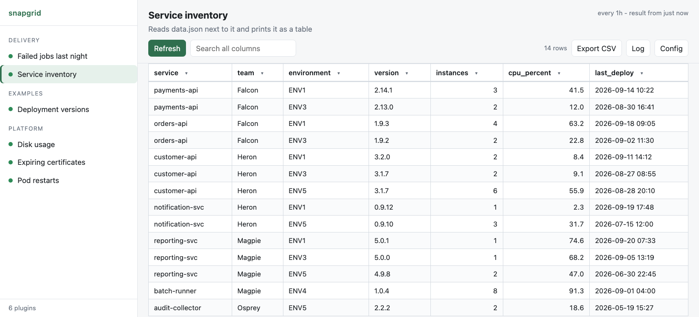
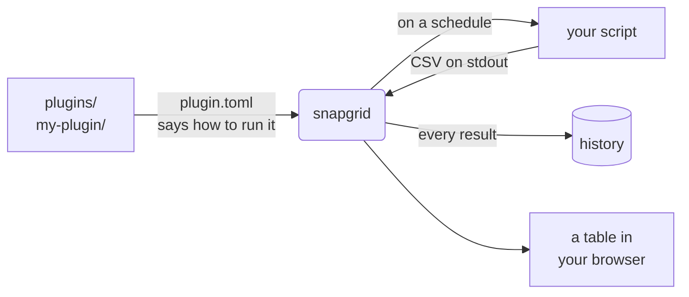

<h1 align="center">snapgrid</h1>

<p align="center">
  <b>Put a script in a folder. Get a table in your browser.</b><br>
  Sortable, filterable, refreshed on a schedule, with history.<br>
  <b>Python standard library only</b> - no pip, no npm, no database, no container, no internet.
</p>

<p align="center">
  <picture>
    <source media="(prefers-color-scheme: dark)" srcset="docs/screenshot-dark.png">
    
  </picture>
</p>

<p align="center"><sub>Sort, filter by value, search, switch plugins. No page reloads, no build step, no dependencies.</sub></p>

<p align="center">
  
  
  
  
</p>

---

## Why

Some data has no dashboard and never will. Versions deployed across your
environments, certificates about to expire, which jobs failed last night. The
answer usually exists as a script somebody runs by hand and pastes into chat.

snapgrid turns that script into a page. **Any script, in any language, that can
print CSV.**

```toml
# plugins/my-plugin/plugin.toml
[plugin]
name = "Expiring certificates"

[run]
command = ["bash", "check.sh"]
every   = "1h"
```

```bash
# plugins/my-plugin/check.sh
echo "host,expires,days_left"
echo "api.example,2026-11-02,39"
```

That is a complete plugin. Drop the folder into `plugins/` and within ten
seconds it is a table in the left panel, refreshing itself every hour.

Tools that do something like this generally want a runtime, a container, a
database or a package manager before they will start. snapgrid wants a `git
clone` and a Python that already exists. That is the whole difference, and on a
machine where you are not allowed to install anything, it is the only one that
matters.

### Coming next

Comparing snapshots: what changed between this run and the last one - which
version moved, which certificate got closer to expiring, which job started
failing. Every result is already stored; showing the difference is next.

## Try it now

```bash
git clone https://github.com/NovaForge2/snapgrid.git && cd snapgrid
```

```bash
./server.py --dir examples
```

Open the address it prints. Two example plugins are already there - **Service inventory** reads a
JSON file, the other invents a table whose values drift over time, so you can
watch the history fill up.

When you want to write your own, restart without `--dir`, which uses `plugins/`:

```bash
./server.py stop && ./server.py
```

## What you get

| | |
|---|---|
| **A real grid** | click to sort, per-column filters with value counts, search everything, export CSV |
| **Runs by itself** | every plugin on a schedule, in the background, results cached so the page is instant |
| **History** | every result kept, with a dropdown to look back. Identical runs do not use a slot, so twenty snapshots means the last twenty times something actually changed |
| **Secrets handled** | `.env` per plugin, values can be encrypted, and they are masked everywhere they would otherwise be shown or stored |
| **Nothing to learn** | print CSV to standard output, exit 0. That is the whole interface |

## How it works



## Requirements

Python 3.11 or newer. That is the whole list. Check with:

```bash
python3 -c "import sqlite3, tomllib; print('ready')"
```

`./server.py` finds a working interpreter itself - it tries `python3`, `python`
and `py`, and uses the first that actually runs, not merely the first that
exists. If your shell will not run the file directly, `python -m snapgrid` and
`python server.py` do the same thing and take the same commands.

## Starting and stopping

```bash
./server.py
```

Where a detached process can be tracked and killed reliably, it runs in the
background and prints the address. Where it cannot, it runs in the terminal you
started it from and Ctrl+C stops it. Either way you can be explicit:
`./server.py start` always runs in the background, `./server.py serve` always
runs in the foreground.


```
snapgrid is running in the background at http://127.0.0.1:8765
  stop   ./server.py stop
  log    plugins/.snapgrid/server.log
```

With no plugins, the page says so and shows the command for running the
examples folder. That message goes away as soon as there is one plugin.

```bash
./server.py status
```

```bash
./server.py stop
```

The address does not move, so it is worth bookmarking. It is 8765 unless you
say otherwise, and `status` and `stop` find the running server without you
having to remember anything. Add `--open` to open your browser as well.

If that port is already taken, snapgrid says so and stops, rather than quietly
moving to another one and changing the address under your bookmark. It also
tells you whether the thing already there is another snapgrid or something
else. To use a different port permanently, set it in `snapgrid.toml`.

To watch it in a terminal instead, run it in the foreground and stop it with
Ctrl+C:

```bash
./server.py serve
```

If `./server.py` does not work on your system, `python3 -m snapgrid` takes the
same commands.

## Your first plugin

A plugin is a folder. Copy the example and edit it:

```bash
cp -r examples/hello-table plugins/my-plugin
```

```
plugins/my-plugin/
    plugin.toml     what it is called and how to run it
    main.py         the script itself, in any language
    data.json       anything else it needs, in this case its data
    .env            optional, secrets for this plugin only
```

The whole folder belongs to the plugin, so a script can read a file next to it
by name.

The folder appears in the web page within about ten seconds. No restart.

If you are having an AI assistant write the plugin, point it at
[AGENTS.md](AGENTS.md) - the same rules written as a specification, with the
output contract, every `plugin.toml` key, worked examples in Python and shell, a
checklist, and what each error message means.

Plugins usually live in a folder of their own rather than in this checkout, and
an assistant working there will not see this repository. Copy the file across so
it does:

```bash
cp AGENTS.md ~/my-plugins/
```

### The contract

Whatever language you write in, three rules:

1. **Standard output is the table.** CSV, starting with a header line.
2. **Standard error is the log.** Progress, warnings, anything for a human.
3. **The exit code decides.** `0` means success, anything else is a failure.

That is the entire interface. It also means you can test a plugin without
snapgrid at all:

```bash
cd plugins/my-plugin && python3 main.py
```

What you see is exactly what snapgrid sees. If that output looks right, the
plugin is right.

## plugin.toml

<details>
<summary><b>Every setting</b> - name, group, command, timeout, schedule, columns, output file, history</summary>

Only `[plugin] name` and `[run] command` are required.

```toml
[plugin]
name        = "OpenShift Image Versions"   # required: shown in the left panel
description = "Image version per repo per environment"
group       = "OpenShift"                  # heading in the left panel
enabled     = true                         # false hides it completely

[run]
command = ["python", "main.py"]            # required: no shell, just arguments
timeout = 300                              # seconds, default 300
every   = "15m"                            # default 15m; "off" for manual only

[table]
columns = ["environment", "image", "version"]

[output]
file = "report.csv"                        # optional: read the table from a file

[history]
keep = 20
```

### `[run] command`

A list of arguments, never a shell command line. There is no shell involved, so
quoting, `&&`, pipes and redirects do not work - put those in a shell script and
run that instead.

```toml
command = ["python", "main.py"]            # Python
command = ["bash", "report.sh"]            # shell script
command = ["java", "-jar", "report.jar"]   # Java
command = ["python", "main.py", "--all"]   # fixed arguments are fine
```

A bare `python` or `python3` means the same interpreter that is running
snapgrid, whichever of the two names exists. Use a full path if you deliberately
want a different one.

### `[table] columns`

Optional. Leave it out and the header line of the output decides the columns and
their order.

When it is present, the header line must match it **exactly**, in names and
order. A mismatch fails the run and shows both lists. That is the point: it
catches a script that quietly changed its output, instead of silently putting
your data under the wrong headings.

### `[output] file`

If your script already writes a file and prints progress while it works, point
snapgrid at the file instead of making the script keep stdout clean:

```toml
[output]
file = "report.csv"
```

Everything the script prints then becomes the run log, to either stream, and
the file is the table. Nothing else about the plugin changes.

**A spreadsheet works too.** Name an `.xlsx` and it is read as one - text,
numbers, dates, booleans and formula results, from the first sheet or the one
you name:

```toml
[output]
file  = "report.xlsx"
sheet = "Summary"        # optional, the first sheet otherwise
```

No library is needed for this: an `.xlsx` is a zip of XML, and Python can read
both. The old binary `.xls` format is not supported - save it as `.xlsx` or
`.csv`.

**A plugin need not run anything at all.** With no `[run] command`, a folder
containing a manifest and a file is a plugin: snapgrid re-reads the file on
each run, so editing it updates the table, and an unchanged file does not
count as a change.

```toml
[plugin]
name = "Contact list"

[run]
every = "1h"

[output]
file = "contacts.xlsx"
```

The file has to live inside the plugin folder, and it has to be written by the
run in progress. A file left from an earlier run is refused with a message
saying when it was written - showing yesterday's numbers as though they were
current is worse than showing an error.

### `[run] every`

`30s`, `15m`, `2h`, or `off`.

The interval is measured from the moment the previous run **finished**, so a
plugin can never overlap with itself and a slow plugin does not fall behind.

Plugins that keep failing are slowed down rather than retried at full speed:
after three failures in a row the interval doubles each time, up to an hour, and
the first success puts it back to normal. Without that, one expired password
fills your history with hundreds of identical failures overnight.

Only a few plugins run at once (three by default, `--max-concurrent`), because
plugins usually talk to the same system with the same credentials. The rest wait
in a queue. Pressing Refresh puts that run at the front of the queue, because
you are sitting there watching it.

### `[history] keep`

Without this section, only the latest result is kept.

With `keep = 20`, the last twenty **different** results are kept. A run that
produces exactly the same table as the one before does not use a slot - it just
updates when that result was last seen. So on a 15 minute schedule, twenty
snapshots means the last twenty times something actually changed, not the last
five hours.

The most recent successful result is always kept, even if every run since then
has failed, so a broken credential never costs you the last good table.

</details>

## Secrets

A `.env` file in a plugin folder is loaded for that plugin only. Values can be
stored encrypted so a password is not readable over your shoulder:

```bash
./server.py encrypt
```

The plugin reads an ordinary environment variable and knows nothing about it,
and decrypted values are masked wherever they would otherwise be shown or
stored. See [docs/secrets.md](docs/secrets.md).

## Tests

```bash
./run-tests.py
```

Nothing to install, and it runs anywhere snapgrid does - including the machine
you are having trouble on, which is usually more informative than describing the
trouble. Around 120 tests covering manifests, the CSV contract, storage and
history, encryption and masking, settings, scheduling and the HTTP API.

Warnings count as failures, so a leaked file handle fails the run rather than
scrolling past.

## When something goes wrong

| What you see | What it means |
|---|---|
| `plugin.toml is not valid TOML` | a typo in the manifest; the message says where |
| `cannot run 'python': no such program` | `[run] command` names something not on your PATH |
| `the header line does not match [table] columns` | the script's output changed, or `columns` is wrong |
| `line 4 has 5 values but there are 4 columns` | a value contains a comma and is not quoted |
| `the script printed nothing on standard output` | the script wrote only to stderr, or produced nothing |
| `the plugin finished but did not write 'report.csv'` | `[output] file` names a file the script never produced |
| `'report.csv' was last written at ... before this run started` | the file is left over from an earlier run |
| `the plugin exited with code 1` | your script failed; the log shows its last line |
| `cannot decrypt value` | wrong key, or the encrypted value was edited |

## Security

<details>
<summary><b>Listens on 127.0.0.1 only, no shell, no HTML injection, and plugins run with your permissions</b></summary>

snapgrid runs programs on your machine, so a few things are deliberate:

- It listens on **127.0.0.1 only**. Nothing else on the network can reach it.
  Do not move it to `0.0.0.0` without putting authentication in front of it -
  there is none built in, and anyone who reaches it can run your plugins with
  your credentials.
- **Anything that starts or stops a run is a POST** carrying a header that a
  page on another site cannot add, and its `Origin` is checked. Otherwise any
  website you happened to visit could quietly tell your browser to run your
  plugins.
- **Plugin output is never treated as HTML.** It reaches the page only as text,
  so a value containing `<script>` is just a value.
- Commands run **without a shell**, so nothing in a value can break out into
  shell syntax.
- Plugins run with **your permissions**. Anyone who can write into `plugins/`
  can run anything as you. Treat that folder the way you treat your own scripts.

</details>

## Reference

- [docs/configuration.md](docs/configuration.md) - `snapgrid.toml`, ports, the banner, using a plugins folder of your own
- [docs/secrets.md](docs/secrets.md) - `.env`, encryption, masking
- [docs/the-web-page.md](docs/the-web-page.md) - what every control does
- [AGENTS.md](AGENTS.md) - the plugin specification, written to hand to an AI assistant

## License

Apache-2.0 - see [LICENSE](LICENSE).

Copyright (C) 2026 NovaForge2
