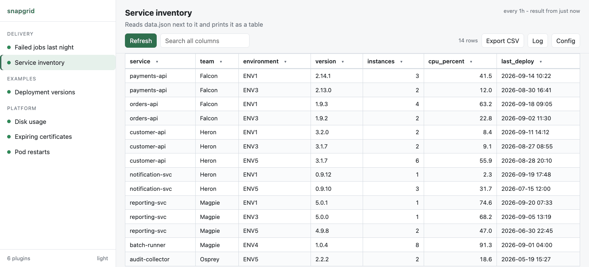
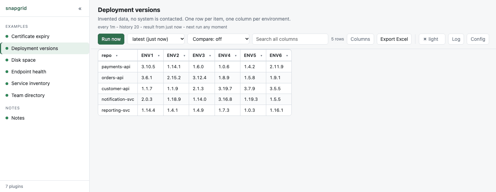
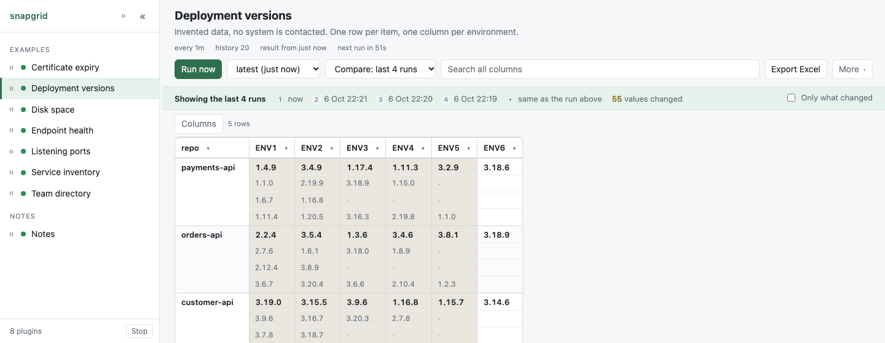
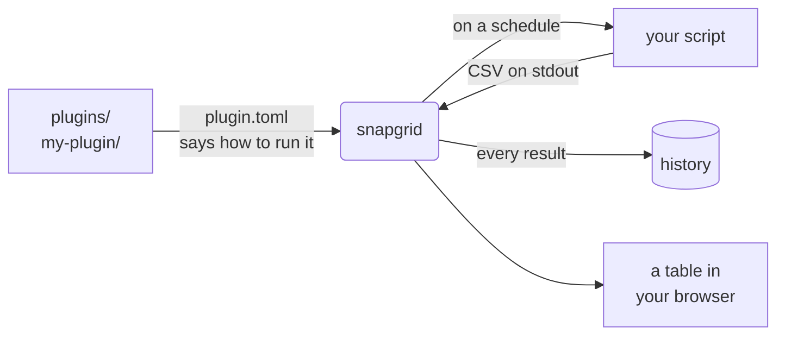

<h1 align="center">snapgrid</h1>

<p align="center">
  <b>Put a script in a folder. Get a table in your browser.</b><br>
  Sortable, filterable, refreshed on a schedule, with history.<br>
  <b>Python standard library only</b> - no pip, no npm, no database server, no container, no internet.
</p>

<p align="center">
  <picture>
    <source media="(prefers-color-scheme: dark)" srcset="docs/demo-dark.gif">
    
  </picture>
</p>

<p align="center"><sub>Sort, filter by value, search, switch plugins. No page reloads, no build step, no dependencies.</sub></p>

<p align="center">
  <a href="https://github.com/NovaForge2/snapgrid/actions/workflows/tests.yml"></a>
  
  
  
  
</p>

---

## Why

Some data has no dashboard and never will. Versions deployed across your
environments, certificates about to expire, which jobs failed last night. The
answer usually exists as a script somebody runs by hand and pastes into chat.

snapgrid turns that script into a page. **Any script, in any language, that can
print CSV.**

```toml
# plugins/my-plugin/plugin.toml
[plugin]
name = "Expiring certificates"

[run]
command = ["bash", "check.sh"]
every   = "1h"
```

```bash
# plugins/my-plugin/check.sh
echo "host,expires,days_left"
echo "api.example,2026-11-02,39"
```

That is a complete plugin. Drop the folder into `plugins/` and within ten
seconds it is a table in the left panel, refreshing itself every hour.

Tools that do something like this generally want a runtime, a container, a
database or a package manager before they will start. snapgrid wants a `git
clone` and a Python that already exists. That is the whole difference, and on a
machine where you are not allowed to install anything, it is the only one that
matters.

Because every result is stored, snapgrid can also show **what changed** between
runs - which version moved, which certificate got closer to expiring, which job
started failing. That is [further down](#seeing-what-changed).

### Not there yet

Being straight about the gaps, since they are the reasons you might want
something else:

- **No alerting.** Nothing is sent anywhere. snapgrid records and shows; you
  look. If you need to be woken up, you need a monitoring system.
- **No authentication**, and so it refuses to listen anywhere but this machine.
- **The schedule is an interval, not a clock.** `"1d"` means a day after the
  last run finished, not nine every morning.
- **No sandbox.** A plugin is a program that runs as you - see
  [SECURITY.md](SECURITY.md).

## Try it now

```bash
git clone https://github.com/NovaForge2/snapgrid.git && cd snapgrid
```

```bash
./server.py --dir examples
```

Open the address it prints. **Seven example plugins** are already there, and all
of them run anywhere with nothing to configure: free disk space, TLS
certificate expiry, endpoint response times, a hand-maintained directory with
no program at all, a script reading a JSON file, and one that invents versions
that drift so you can watch the history and the comparison fill up.

Each has a README explaining how it works and what to change -
see [examples/](examples/).

When you want to write your own, restart without `--dir`, which uses `plugins/`:

```bash
./server.py stop && ./server.py
```

## What you get

| | |
|---|---|
| **A real grid** | click to sort, per-column filters with value counts, search everything, export to Excel |
| **Colour where it helps** | a plugin can put red, amber, green, blue or grey on named values in a column, and the colour follows into the export |
| **Runs by itself** | every plugin on a schedule, in the background, results cached so the page is instant |
| **Pause what you are not using** | one plugin or all of them, off the schedule and back on, without editing anything. The last result stays and `Run now` still works |
| **History** | every result kept, with a dropdown to look back. Identical runs do not use a slot, so twenty snapshots means the last twenty times something actually changed |
| **What changed** | compare the last 2 to 5 runs in the table itself - values that moved, rows that appeared, rows that went - and click any value for its own history |
| **Secrets handled** | `.env` per plugin, values can be encrypted, and they are masked everywhere they would otherwise be shown or stored |
| **Nothing to learn** | print CSV to standard output, exit 0. That is the whole interface |

## Seeing what changed

A table tells you how things are. The question people actually ask is **what
moved, and when** - and that is what the stored history is for.

<p align="center">
  <picture>
    <source media="(prefers-color-scheme: dark)" srcset="docs/diff-dark.gif">
    
  </picture>
</p>

Pick how far back to look - the run before, or up to five runs - and any cell
that moved fills in with what it held each time, newest on top. The ones that
did not move stay as they were, so the deep cells are the changes:

<p align="center">
  <picture>
    <source media="(prefers-color-scheme: dark)" srcset="docs/diff-dark.png">
    
  </picture>
</p>

- **A dot means "the same as the line above."** Only values that actually moved
  are written out, so the eye lands on them rather than on forty repetitions of
  the same version.
- **Nothing is struck through.** An older value was not deleted; it is just
  older, so it is smaller and quieter.
- **Rows that appeared** are marked `NEW`, **rows that went** are marked `GONE`
  and are shown even though they are not in the current result - a repository
  disappearing from an environment is exactly the thing worth noticing.
- **Which run is which** is written once, in the strip above the table. There is
  no room for a date inside a cell, and every cell shares the same runs.
- **Only what changed** narrows a forty row table to the three rows that moved.
- **Click any value** for the full history of that one cell, further back than
  the comparison goes.

Rows are lined up by the column that names them - the first column, or
whichever one `[table] key` names. If the columns are not the same in every run,
comparing is refused with a reason rather than guessing which column is which.

The view is in the address, so a link carries it:

```
http://127.0.0.1:8765/?plugin=image-versions&compare=3&changed=1
```

## How it works


```mermaid
flowchart LR
    A["plugins/<br/>my-plugin/"] -->|"plugin.toml<br/>says how to run it"| B(snapgrid)
    B -->|"on a schedule"| C["your script"]
    C -->|"CSV on stdout"| B
    B -->|"every result"| D[("history")]
    B --> E["a table in<br/>your browser"]
```

## Requirements

Python 3.11 or newer. That is the whole list. Check with:

```bash
python3 -c "import sqlite3, tomllib; print('ready')"
```

`./server.py` finds a working interpreter itself - it tries `python3`, `python`
and `py`, and uses the first that actually runs, not merely the first that
exists. If your shell will not run the file directly, `python -m snapgrid` and
`python server.py` do the same thing and take the same commands.

## Starting and stopping

```bash
./server.py
```

Where a detached process can be tracked and killed reliably, it runs in the
background and prints the address. Where it cannot, it runs in the terminal you
started it from and Ctrl+C stops it. Either way you can be explicit:
`./server.py start` always runs in the background, `./server.py serve` always
runs in the foreground.


```
snapgrid is running in the background at http://127.0.0.1:8765
  stop   ./server.py stop
  log    plugins/.snapgrid/server.log
```

With no plugins, the page says so and shows the command for running the
examples folder. That message goes away as soon as there is one plugin.

```bash
./server.py status
```

```bash
./server.py stop
```

Or press **Stop**, at the bottom of the left panel. The page then says how to
start it again, because by then there is nothing left to click.

The address does not move, so it is worth bookmarking. It is 8765 unless you
say otherwise. `status` and `stop` find the server on that port even when it
was started from a different plugins folder - you do not have to remember
which `--dir` you typed, only which port. Add `--open` to open your browser as
well.

If that port is already taken, snapgrid says so and stops, rather than quietly
moving to another one and changing the address under your bookmark. It also
tells you whether the thing already there is another snapgrid or something
else. To use a different port permanently, set it in `snapgrid.toml`.

To watch it in a terminal instead, run it in the foreground and stop it with
Ctrl+C:

```bash
./server.py serve
```

If `./server.py` does not work on your system, `python3 -m snapgrid` takes the
same commands.

### What it writes to disk

Three files, in a hidden `.snapgrid` folder inside your plugins folder. It is
made on first start and nothing else on the machine is touched.

```
plugins/.snapgrid/
    snapgrid.db      every run and every result
    server.log       the server's own log
    server.json      the pid and port of the running server
```

`snapgrid.db` is **SQLite**, which is part of Python - a file, not a service to
install or run. There is one of it for the whole server, holding every plugin's
runs and results; nothing is written into a plugin's own folder. You may also see `snapgrid.db-wal` and `snapgrid.db-shm` beside
it while the server is up; those are SQLite's own working files.

Deleting the folder loses your history and nothing else: it is rebuilt on the
next start.

One plugins folder is one workspace with its own database, so a second folder
is completely independent. `--data` puts these files somewhere else, and if
your plugins folder is a repository of your own, add `.snapgrid/` to its
`.gitignore`.

You can read the database with anything that speaks SQLite, which is a quick
way to see what happened without the page:

```bash
sqlite3 plugins/.snapgrid/snapgrid.db \
  "select plugin_id, status, error from runs order by id desc limit 10"
```

The tables are described in
[docs/configuration.md](docs/configuration.md#what-is-on-disk).

## Your first plugin

A plugin is a folder. Copy the example and edit it:

```bash
cp -r examples/hello-table plugins/my-plugin
```

```
plugins/my-plugin/
    plugin.toml     what it is called and how to run it
    main.py         the script itself, in any language
    data.json       anything else it needs, in this case its data
    .env            optional, secrets for this plugin only
```

The whole folder belongs to the plugin, so a script can read a file next to it
by name.

The folder appears in the web page within about ten seconds. No restart.

If you are having an AI assistant write the plugin, point it at
[AGENTS.md](AGENTS.md) - the same rules written as a specification, with the
output contract, every `plugin.toml` key, worked examples in Python and shell, a
checklist, and what each error message means.

Plugins usually live in a folder of their own rather than in this checkout, and
an assistant working there will not see this repository. Copy the file across so
it does:

```bash
cp AGENTS.md ~/my-plugins/
```

### The contract

Whatever language you write in, three rules:

1. **Standard output is the table.** CSV, starting with a header line. Or a
   file, or a spreadsheet - see
   [where the table comes from](docs/where-the-table-comes-from.md).
2. **Standard error is the log.** Progress, warnings, anything for a human.
3. **The exit code decides.** `0` means success, anything else is a failure.

That is the entire interface. It also means you can test a plugin without
snapgrid at all:

```bash
cd plugins/my-plugin && python3 main.py
```

What you see is exactly what snapgrid sees. If that output looks right, the
plugin is right.

## plugin.toml

Only `[run] command` is required, and even that is optional when a file is the
source.

```toml
[plugin]
name        = "Image versions"
description = "Version per repository per environment"
group       = "Platform"          # a heading in the left panel

[run]
command = ["python", "main.py"]   # an argument list, run without a shell
timeout = "5m"                    # or a number of seconds
every   = "15m"                   # s, m, h, d, w - or "off" for manual only

[table]
columns = ["repo", "ENV1", "ENV2"]  # optional: the header must then match
key     = "repo"                    # which column names a row, for comparing

[output]
file      = "report.csv"          # read the table from a file instead of stdout
fresh_for = "30m"                 # and skip the run while the file is young

[history]
keep = 20                         # how many *differing* results to keep
```

Four things worth knowing without reading further:

- **`command` is a list, not a command line.** There is no shell, so pipes,
  `&&` and `$VARIABLES` do not work. Put those in a script and run the script.
- **`every` is measured from the end of the previous run**, so a plugin cannot
  overlap with itself. It is an interval, not a clock: `"1d"` means a day after
  the last one finished, not nine every morning.
- **`timeout` is per plugin**, not a server setting, because it depends
  entirely on the work.
- **`key` is how two runs are lined up** when comparing them, and defaults to
  the first column. Keep its values stable and unique.

**[docs/plugin-toml.md](docs/plugin-toml.md) is the full reference** - every
key, its default, what it accepts, and every message it can refuse with.

## Secrets

A `.env` file in a plugin folder is loaded for that plugin only. Values can be
stored encrypted so a password is not readable over your shoulder:

```bash
./server.py encrypt
```

The plugin reads an ordinary environment variable and knows nothing about it,
and decrypted values are masked wherever they would otherwise be shown or
stored. See [docs/secrets.md](docs/secrets.md).

## Tests

```bash
./run-tests.py
```

Nothing to install, and it runs anywhere snapgrid does - including the machine
you are having trouble on, which is usually more informative than describing the
trouble. Around 180 tests covering manifests, the CSV contract, storage and
history, encryption and masking, settings, scheduling and the HTTP API.

Warnings count as failures, so a leaked file handle fails the run rather than
scrolling past.

Working out **what changed between runs** happens in the browser, so its tests
run there too, on node's own test runner - no package.json, nothing installed.
`./run-tests.py` runs them as well, and says plainly when node is absent rather
than reporting a green total that quietly covered less. node is needed to run
that part of the suite; it is never needed to *use* snapgrid.

Every push and every pull request runs the same command on **Linux, macOS and
Windows against Python 3.11, 3.12 and 3.13** - nine combinations, no
installation step in any of them. The build also fails if a `requirements.txt`
appears or if anything in the project imports a module that is not part of
Python, because "nothing to install" is the one promise worth enforcing rather
than stating.

**CodeQL** analyses the source on every push as well, looking hardest at the
places that turn something from outside into a file or a process: serving files
by name, unpacking a spreadsheet, and starting a plugin. Findings appear under
the repository's Security tab.

## When something goes wrong

| What you see | What it means |
|---|---|
| `plugin.toml is not valid TOML` | a typo in the manifest; the message says where |
| `cannot run 'python': no such program` | `[run] command` names something not on your PATH |
| `the header line does not match [table] columns` | the script's output changed, or `columns` is wrong |
| `line 4 has 5 values but there are 4 columns` | a value contains a comma and is not quoted |
| `the script printed nothing on standard output` | the script wrote only to stderr, or produced nothing |
| `the plugin finished but did not write 'report.csv'` | `[output] file` names a file the script never produced |
| `'report.csv' was last written at ... before this run started` | the file is left over from an earlier run |
| `the plugin exited with code 1` | your script failed; the log shows its last line |
| `cannot decrypt value` | wrong key, or the encrypted value was edited |

## Security

> **A plugin is a program, and snapgrid runs it as you.**
> Adding a plugin is exactly as serious as running a script somebody sent you:
> it gets your account, your files, your network and whatever is in its `.env`.
> **snapgrid is not a sandbox and does not try to be one.** Read a plugin before
> you add it, and treat write access to the plugins folder as the ability to run
> code as you.
>
> Full detail, including the threat model for the encryption, is in
> [SECURITY.md](SECURITY.md).

The rest is deliberate:

- It listens on **127.0.0.1 only**. Nothing else on the network can reach it,
  which is why plain HTTP is enough: the traffic never touches a network
  interface, so there is nothing on a wire to encrypt.
- **It refuses to listen anywhere else.** There is no login, so on any other
  address whoever reaches the port could read every table and press Run now on
  every plugin, using the credentials in your `.env` files. `--host 0.0.0.0`
  stops with an explanation rather than doing it quietly. Setting
  `SNAPGRID_ALLOW_ANY_HOST=1` overrides that and says so at startup, every time.
- **Every request must be addressed to this machine.** A website can point its
  own hostname at `127.0.0.1`, and the browser will then treat it as the same
  origin and let it read the answers - but it still sends that site's name in
  the `Host` header, which it cannot forge. A request addressed to anything but
  `localhost` is refused. This is the only way in that listening on loopback
  does not already close.
- **Anything that starts or stops a run is a POST** carrying a header that a
  page on another site cannot add, and its `Origin` is checked. Otherwise any
  website you happened to visit could quietly tell your browser to run your
  plugins.
- **Plugin output is never treated as HTML.** It reaches the page only as text,
  so a value containing `<script>` is just a value.
- Commands run **without a shell**, so nothing in a value can break out into
  shell syntax.
- Plugins run with **your permissions**. Anyone who can write into `plugins/`
  can run anything as you. Treat that folder the way you treat your own scripts -
  it is a stronger control than anything at the HTTP layer, because a plugin is
  code you have agreed to run on a schedule with your credentials loaded.
- The **encryption for `.env` values is written in this project**, not taken
  from a library, because nothing can be installed. It is meant to stop a
  password being readable over your shoulder, not to withstand someone who
  already has your account. See [SECURITY.md](SECURITY.md#the-encryption-is-written-in-this-project).

## Reference

- [docs/plugin-toml.md](docs/plugin-toml.md) - every `plugin.toml` key: command, timeout, schedule, columns, output, history
- [docs/configuration.md](docs/configuration.md) - `snapgrid.toml`, ports, the banner, using a plugins folder of your own
- [SECURITY.md](SECURITY.md) - what snapgrid does and does not protect you from, and how to report something
- [docs/secrets.md](docs/secrets.md) - `.env`, encryption, masking
- [docs/where-the-table-comes-from.md](docs/where-the-table-comes-from.md) - stdout, a CSV file, a spreadsheet, or no script at all
- [examples/](examples/) - seven plugins that run anywhere, each with its own explanation
- [CHANGELOG.md](CHANGELOG.md) - what changed and why it might matter to you
- [docs/the-web-page.md](docs/the-web-page.md) - what every control does: sorting, filters, showing and sizing columns, resizing and hiding the panels, following the log, light and dark
- [AGENTS.md](AGENTS.md) - the plugin specification, written to hand to an AI assistant

## License

Apache-2.0 - see [LICENSE](LICENSE).

Copyright (C) 2026 NovaForge2
