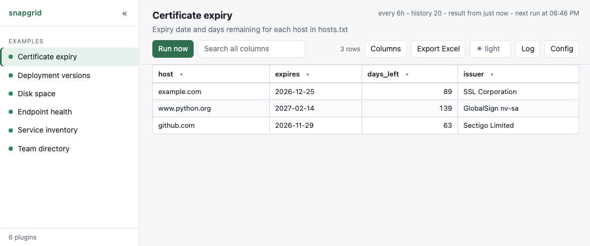

# Certificate expiry

When each TLS certificate expires, and how many days are left. The question
nobody asks until the morning a service stops working.

<p align="center">
  <picture>
    <source media="(prefers-color-scheme: dark)" srcset="screenshot-dark.png">
    
  </picture>
</p>

**What the plugin prints:**

```
host,expires,days_left,issuer
example.com,2026-12-25,89,SSL Corporation
www.python.org,2027-02-14,139,GlobalSign nv-sa
github.com,2026-11-29,63,Sectigo Limited
```

No credentials of any kind. A server hands its certificate to anybody who
connects — that is what a public certificate is for.

## See it

```bash
./server.py --dir examples
```

It is in the list on the left. To keep it, copy the folder into your own
plugins folder and it appears there within ten seconds:

```bash
cp -r examples/certificate-expiry plugins/
```

Then put your own hosts in `hosts.txt`, one per line:

```
example.com
intranet.example.internal:8443     # a port other than 443
# lines starting with a hash are ignored
```

Sort the `days_left` column and whatever expires next is at the top, which is
the whole point of the table.

## How it works

A TLS handshake, and nothing more. `ssl` and `socket` are in the standard
library; `getpeercert()` gives back the certificate the server presented, and
`notAfter` in it is the expiry, always in UTC.

Sorting the `days_left` column puts whatever expires next at the top, which is
the whole point of the table.

## Three things worth reading before you copy it

**Every network call has its own timeout.** `TIMEOUT_SECONDS = 6` per host.
Without that, one unreachable host holds the entire run until `[run] timeout`
kills it — and then none of the other hosts get checked either. A plugin that
talks to anything needs its own timeout, always, separate from the one in
`plugin.toml`.

**A host that fails keeps its row, with empty values.** It is not dropped. A
host disappearing from the table reads as "nobody is watching this any more",
which is the opposite of what happened. The reason goes to standard error, and
the run still exits `0` as long as one host answered — because one unreachable
server is not a failed report.

If *no* host answers it exits `1`. That is almost certainly the network rather
than every server at once, and snapgrid keeps the last good table instead of
replacing it with a screen of blanks.

**Certificate authorities.** Some Python installations arrive with none
configured — a python.org build on macOS is the usual one — and then every
handshake fails with `unable to get local issuer certificate`, which reads like
a server problem and is not. The script looks for the system bundle
(`/etc/ssl/cert.pem` and the Linux equivalents) and says in the log which one
it used. On Windows the default already reads the Windows certificate store,
so an authority your IT installed is trusted with nothing to do.

## If your network intercepts TLS

Many corporate networks do. Your machine trusts a company authority, the proxy
terminates the connection, and what you receive is the proxy's certificate
rather than the server's.

It will verify, and **the date reported will be the proxy's date, not the real
server's.** That is not a flaw here; it is what your browser sees too. You can
recognise it by the `issuer` column saying your employer rather than a public
authority.

There is deliberately no unverified fallback: Python only parses a certificate
it has verified, so an unverified handshake gives back an empty dictionary with
no date in it to report.

## What this example shows

- **A network call with its own timeout**, which is the single most common way
  a plugin ends up hanging until `[run] timeout`.
- **Failing one row without failing the run**, and the difference between "one
  host is down" and "nothing worked".
- **Dates as `YYYY-MM-DD`**, so the column sorts correctly as text. A local
  format like `25/12/2026` sorts by day of the month.
- **`every = "6h"`.** Certificates change perhaps twice a year. Checking every
  minute would be rude to the servers and tell you nothing new.
- **`[history] keep`**, which makes "when was this renewed?" answerable.

## When it is not working

Run the program by hand. What it prints is exactly what snapgrid sees, with
nothing in between:

```bash
cd plugins/certificate-expiry && python3 main.py
```

Standard output is the table, standard error is the log, and `echo $?` shows
whether it thought it succeeded. If that output looks right, the plugin is
right, and the problem is in `plugin.toml`.

The **Log** and **Config** buttons in the page show the same two things from
the last real run - what it printed, and the manifest exactly as snapgrid read
it.
