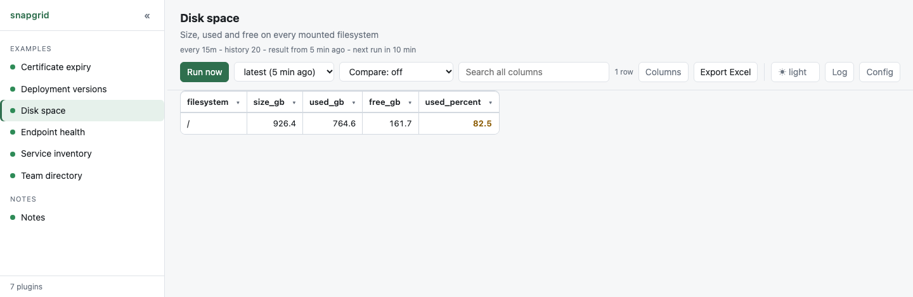

# Disk space

How much room is left on each disk. The simplest useful plugin there is: no
network, no credentials, nothing to configure. Copy the folder and it works.

<p align="center">
  <picture>
    <source media="(prefers-color-scheme: dark)" srcset="screenshot-dark.png">
    
  </picture>
</p>

**What the plugin prints:**

```
filesystem,size_gb,used_gb,free_gb,used_percent
/,926.4,759.5,166.9,82.0
```

## See it

```bash
./server.py --dir examples
```

It is in the list on the left. To keep it, copy the folder into your own
plugins folder and it appears there within ten seconds:

```bash
cp -r examples/disk-space plugins/
```

## How it works

`shutil.disk_usage` is in the standard library and gives total, used and free
bytes for any path. The only real work is deciding **which** paths to ask
about, and that differs by system:

| System | Where the list comes from |
|---|---|
| Windows | every drive letter `A:` to `Z:` that exists |
| Linux | `/proc/mounts`, skipping virtual filesystems |
| macOS, anything else | just `/` |

Three small cases rather than one clever one. The list of mounted filesystems
genuinely lives in a different place on each, and a clever guess would report
nothing at all rather than fail loudly.

Virtual filesystems are skipped on Linux because they report sizes that mean
nothing: a `squashfs` image is always 100% full and would sit at the top of a
sorted table for ever.

## What to change

**Only the disks you care about.** Replace `places_to_measure()` with a list:

```python
def places_to_measure() -> list[str]:
    return ["/", "/var", "/data"]
```

**Different units.** `GIGABYTE = 1024 ** 3` at the top; change it and the
column names together, or the header will say `gb` about megabytes.

**Alert on a threshold.** Don't. A plugin reports; something else decides. If
you want only the full ones, filter the column in the page instead.

## What this example shows

- **Plain values, no units.** `82.0`, not `82%` or `759.5 GB`. A column where
  every value is a number sorts as numbers; add a `%` and it sorts as text,
  so `9` comes after `82`.
- **One bad row is not a failed run.** An unreadable mount is logged to
  standard error and skipped; the rest of the table still arrives.
- **Nothing measured is a failure.** If no filesystem could be read at all it
  exits `1`, so snapgrid keeps yesterday's good table instead of replacing it
  with an empty one. A plugin that reports success with no rows is worse than
  one that fails.
- **`[table] key`** names the column that identifies a row, so comparing two
  runs can say "this filesystem changed" rather than "one row left and another
  arrived".
- **`[history] keep = 20`** makes "when did this start filling up?" a question
  the page can answer.
- **`[colour.used_percent]`** turns the number red past 90 and amber past 80,
  so a disk filling up says so rather than waiting to be read. The rules are
  tried in the order written and the first match wins, which is why 90 is
  above 80: the other way round, 95 would be amber. A column of numbers keeps
  its alignment - the colour goes on the figures, not into a badge.

## The same thing as a shell script

`command` takes any program, so a pipeline is fine when the work really is a
pipeline. This is the POSIX equivalent, minus the careful parts:

```bash
#!/usr/bin/env bash
set -euo pipefail
echo "filesystem,used,available"
df -h | tail -n +2 | awk '{print $1","$3","$4}'
```

```toml
[run]
command = ["bash", "report.sh"]
```

Shorter, and it does not run on Windows, does not skip virtual filesystems and
prints `45G` where a number belongs. Which is the trade: reach for the shell
when the work is a pipeline, and for Python when the details matter.

## When it is not working

Run the program by hand. What it prints is exactly what snapgrid sees, with
nothing in between:

```bash
cd plugins/disk-space && python3 main.py
```

Standard output is the table, standard error is the log, and `echo $?` shows
whether it thought it succeeded. If that output looks right, the plugin is
right, and the problem is in `plugin.toml`.

The **Log** and **Config** buttons in the page show the same two things from
the last real run - what it printed, and the manifest exactly as snapgrid read
it.
