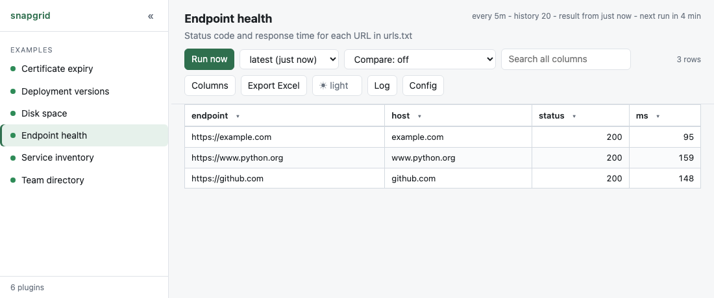

# Endpoint health

Whether each endpoint answers, and how quickly.

<p align="center">
  <picture>
    <source media="(prefers-color-scheme: dark)" srcset="screenshot-dark.png">
    
  </picture>
</p>

**What the plugin prints:**

```
endpoint,host,status,ms
https://example.com,example.com,200,123
https://www.python.org,www.python.org,200,106
https://github.com,github.com,200,156
```

## See it

```bash
./server.py --dir examples
```

It is in the list on the left. To keep it, copy the folder into your own
plugins folder and it appears there within ten seconds:

```bash
cp -r examples/endpoint-health plugins/
```

Then put your own URLs in `urls.txt`, one per line:

```
https://intranet.example.internal/health
https://payments.example.internal/actuator/health
# lines starting with a hash are ignored
```

## How it works

A `HEAD` request per URL with `urllib`, timed with `time.monotonic()`.

**`HEAD`, not `GET`**, deliberately. It asks for the headers and no body: the
lightest question that still proves the thing is answering, and one that cannot
change anything at the other end. A plugin reports; it does not act. If an
endpoint of yours does not support `HEAD`, change `METHOD` at the top — but
prefer a real health URL that does.

**`time.monotonic()`, not `time.time()`.** A clock that is adjusted mid-request
— by NTP, or by daylight saving — can make `time.time()` go backwards and
produce a negative duration. The monotonic clock only moves forwards, which is
the only thing you want from a stopwatch.

## Why a 404 goes in the table and not the log

A `404` or a `500` is an **answer**. The endpoint is up and saying something,
and "it is up but returning 500" is exactly the sort of thing this table exists
to show. Both land in the `status` column.

Only a connection that never completes — refused, unresolved, timed out — has
no status to report. That row keeps its endpoint with empty values so it does
not vanish from the table, and the reason goes to standard error.

The run exits `0` as long as one endpoint answered. If **nothing** answered
that is almost certainly your network rather than every service at once, so it
exits `1` and snapgrid keeps the last good table.

## Certificate authorities

Some Python installations arrive with none configured — a python.org build on
macOS is the usual one — and then every `https` call fails with `unable to get
local issuer certificate`, which reads like the endpoint is broken and is not.
The script looks for the system bundle and says in the log which one it used.
On Windows the default already reads the Windows certificate store, so an
authority your IT installed is trusted with nothing to do.

## What this example shows

- **Numbers in their own column.** `ms` is a plain number, so sorting it puts
  the slowest endpoint at the top. Write `123ms` and the column sorts as text.
- **A separate `host` column.** The full URL is the key because two paths on
  one host are two endpoints, but `host` lets you filter a whole service at
  once from the page.
- **Every call has its own timeout**, so one dead endpoint cannot hold the run
  until `[run] timeout` and take the rest down with it.
- **`every = "5m"`.** Often enough to notice something, rare enough to be
  polite to the thing you are asking. This is not a monitoring system and
  should not behave like one.

## What it is not

It is not an alerting tool. It records what answered and how fast, on a
schedule, and shows you the history. Nothing here pages anybody, and if an
endpoint is down at 3am you will find out when you look.

If you need alerting, you need a monitoring system. This is for the question
"has that been slow all week, or only now?"

## When it is not working

Run the program by hand. What it prints is exactly what snapgrid sees, with
nothing in between:

```bash
cd plugins/endpoint-health && python3 main.py
```

Standard output is the table, standard error is the log, and `echo $?` shows
whether it thought it succeeded. If that output looks right, the plugin is
right, and the problem is in `plugin.toml`.

The **Log** and **Config** buttons in the page show the same two things from
the last real run - what it printed, and the manifest exactly as snapgrid read
it.
