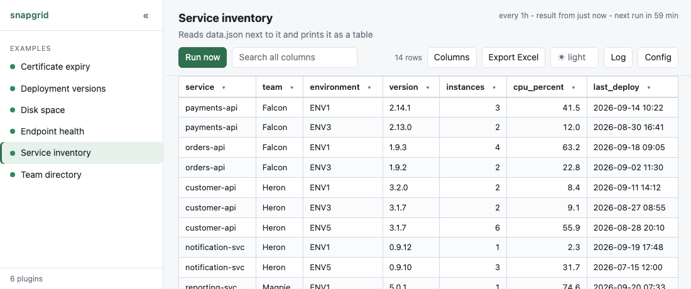

# Service inventory

The smallest complete plugin: it reads `data.json` next to it and prints the
rows as CSV. Start here.

<p align="center">
  <picture>
    <source media="(prefers-color-scheme: dark)" srcset="screenshot-dark.png">
    
  </picture>
</p>

**What the plugin prints:**

```
service,team,environment,version,instances,cpu_percent,last_deploy
payments-api,Payments,ENV1,2.14.1,4,37.2,2026-09-14 10:22
```

## See it

```bash
./server.py --dir examples
```

It is in the list on the left as **Service inventory**. To start your own
plugin from it:

```bash
cp -r examples/hello-table plugins/my-plugin
```

Then edit `main.py` to get rows from wherever your data actually lives.

## How it works

Three steps, and every plugin is a variation on them:

1. get some rows from somewhere - here, a JSON file next to the script;
2. print them as CSV on standard output, header line first;
3. exit `0`.

A real plugin calls a command, queries an API or reads a database instead. The
shape does not change.

## Worth noticing

- **`csv.writer`, never string joining.** A value containing a comma or a
  quote has to be escaped correctly, and hand-rolled joining gets it wrong on
  the first name with a comma in it.
- **`COLUMNS` decides what is in the table**, so adding a field to `data.json`
  does not silently change the table.
- **`[table] columns` in `plugin.toml` repeats that list**, and the run fails
  if the header stops matching it. That is the point: it catches a script that
  quietly changed its output instead of putting your data under the wrong
  headings.
- **Dates as `YYYY-MM-DD HH:MM`**, so the column sorts correctly as text.

## When it is not working

Run the program by hand. What it prints is exactly what snapgrid sees:

```bash
cd plugins/my-plugin && python3 main.py
```

Standard output is the table, standard error is the log, and `echo $?` shows
whether it thought it succeeded.
