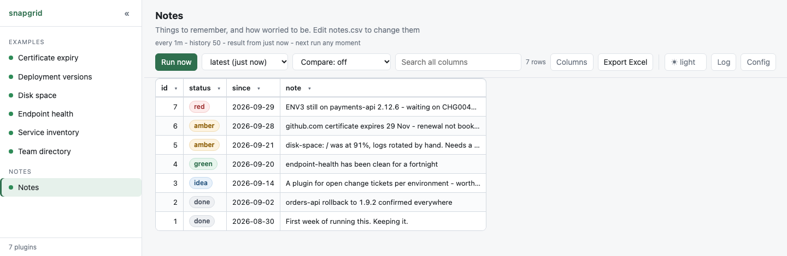

# Notes

**A list you keep yourself, with a colour on each line.**

There is no script in this folder. There is a manifest and a CSV file, and that
is a complete plugin: snapgrid re-reads the file on every run, so saving an
edit updates the table.

<p align="center">
  <picture>
    <source media="(prefers-color-scheme: dark)" srcset="screenshot-dark.png">
    
  </picture>
</p>

**What the file holds:**

```
id,status,since,note
7,red,2026-09-29,"ENV3 still on payments-api 2.12.6 - waiting on CHG0045123"
6,amber,2026-09-28,github.com certificate expires 29 Nov - renewal not booked yet
2,done,2026-09-02,orders-api rollback to 1.9.2 confirmed everywhere
```

## What this is for

A table says how things are. It cannot say **why**, or what you decided to do
about it. That is what this is: somewhere to write down why ENV3 is still on
the old version, next to the table that shows it is.

It is deliberately not a comment system. snapgrid listens on `127.0.0.1` and
has no accounts, so there is nobody else to write to - these notes are yours,
on your machine, in a file you can read without snapgrid at all.

## See it

```bash
./server.py --dir examples
```

It is in the list on the left, under **Notes**. To keep it, copy the folder
into your own plugins folder:

```bash
cp -r examples/notes plugins/
```

Then edit `plugins/notes/notes.csv` in any editor and save. The table catches
up within the minute, or press **Run now** to see it at once.

## Colour

```toml
[colour.status]
red   = "red"
amber = "amber"
green = "green"
idea  = "blue"
done  = "grey"
```

The column is named, then each value that gets a colour. Matching is on the
whole value and ignores case, so `Red` and `red` are the same thing. **A value
nobody named is left plain**, which is what makes this safe on a column that
can say anything - the words you care about stand out and the rest reads
normally.

The colours are **red, amber, green, blue and grey**. There are no others, and
a manifest naming one that does not exist is refused with the list. A plugin
choosing its own shades would be a plugin deciding what the page looks like,
and both the light and the dark theme have to live with the result.

The colour follows the value into **Export Excel**, so a workbook sent to
somebody says the same thing the screen did.

Nothing about this is particular to notes. Any column with a small fixed set of
values wants it: a `status` of `ok` / `expiring` / `expired`, an environment, a
severity.

## Why the columns are what they are

- **`id` first**, because `[table] key` defaults to the first column and the
  key is what lines two runs up. Numbers that only ever grow mean a new note
  is a new row rather than an edit to an old one.
- **`status` second**, so the colour is the first thing the eye meets.
- **`since`**, and this one matters more than it looks. **A hand-set status
  rots**: in a fortnight half of them are amber and nobody remembers whether
  that is still true. With the date it was set, "amber since 21 September"
  says plainly that it needs another look. Sort by it to find the stale ones.
- **`note` last**, because it is the long one, and a long column in the middle
  pushes everything else off the screen.

## History

```toml
[history]
keep = 50
```

Every save that changes the file is a result, so the history dropdown is the
record of what this list said, and the comparison shows what changed between
two states of it - a note added, a status moved from red to green. A save that
changes nothing does not take a slot.

## What it does not do

- **No editing in the page.** You edit the file. Everything snapgrid writes is
  regenerable - delete `.snapgrid` and nothing is lost - and these notes would
  be the first thing that is not. Keeping them in a file you own means they
  survive snapgrid entirely.
- **No reminders.** `since` plus sorting is what there is.
- **No threads, no replies, no names.** See above: there is nobody to reply to.
