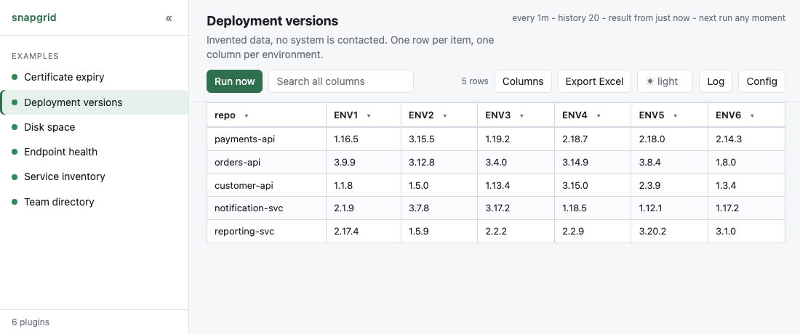

# Deployment versions

Invented data: one row per repository, one column per environment, with
versions that drift a little on every run. It exists so that the **history**
and the **comparison** have something to show without waiting a week.

<p align="center">
  <picture>
    <source media="(prefers-color-scheme: dark)" srcset="screenshot-dark.png">
    
  </picture>
</p>

## See it

```bash
./server.py --dir examples
```

Press **Run now** a few times, then set the second dropdown to **Compare with:
the one before**. Every cell fills in with what it held on each run, and the
values that moved are the only ones written out.

## Why the table is this shape

```
repo,ENV1,ENV2,ENV3,ENV4
payments-api,2.14.1,2.15.0,2.13.0,2.12.6
orders-api,1.9.3,1.9.3,1.9.2,1.9.0
```

**One row per thing, one column per place.** The alternative - a long
`repo,environment,version` table with a row per combination - holds the same
data and is far harder to read when the question is *where do these differ?*

It is also the shape the comparison is most useful on: the row name stays put
while the values under it change, which is exactly what `[table] key` needs.

## What is invented, and what is not

The versions are random and drift on purpose. Everything else is real: it is a
normal plugin, run on a schedule, stored and compared like any other.

A real version of this would ask your platform what is deployed - `oc`,
`kubectl`, an API - and print the same shape. The table, the history and the
comparison would behave identically.

## When it is not working

```bash
cd plugins/version-matrix && python3 main.py
```

What it prints is exactly what snapgrid sees.
